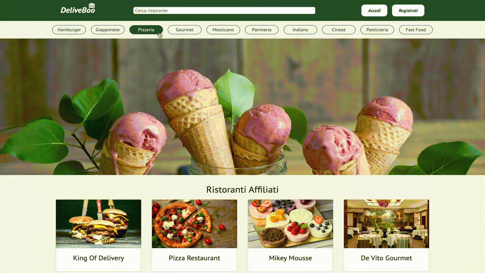
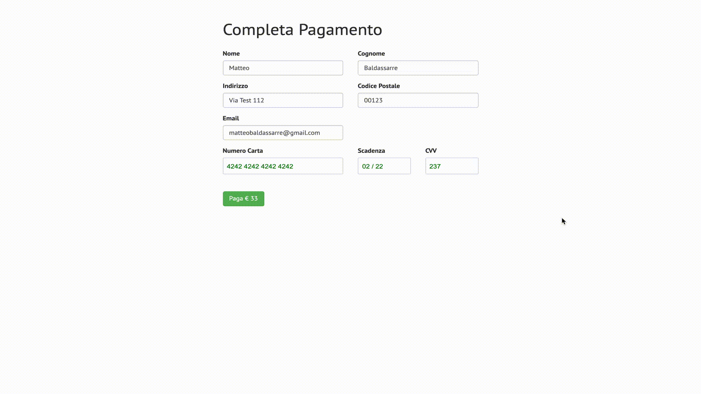
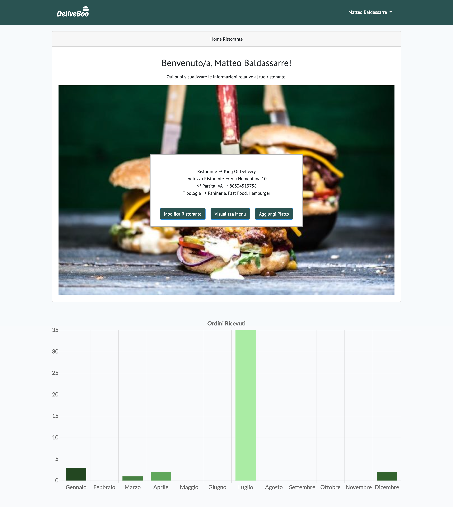
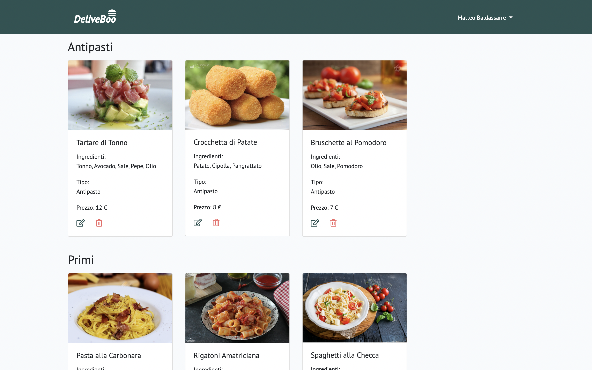
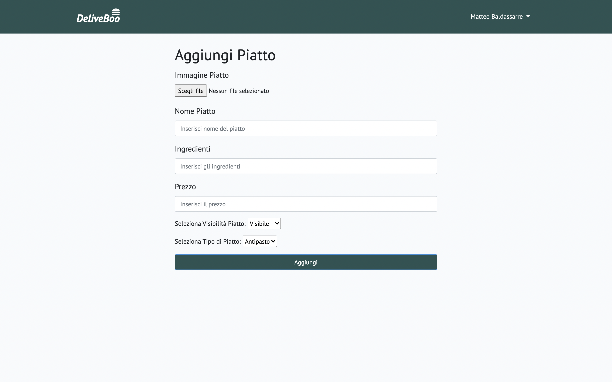
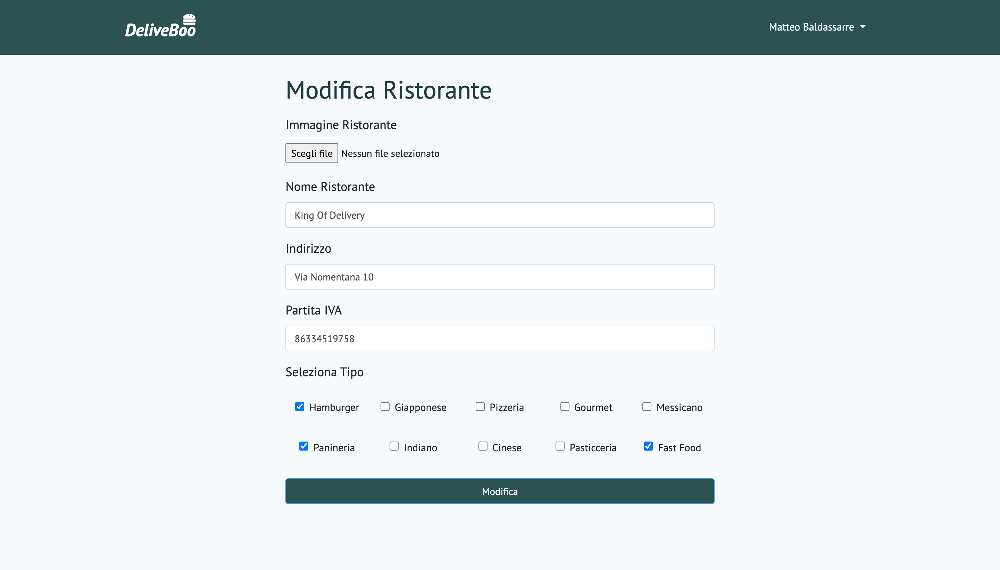
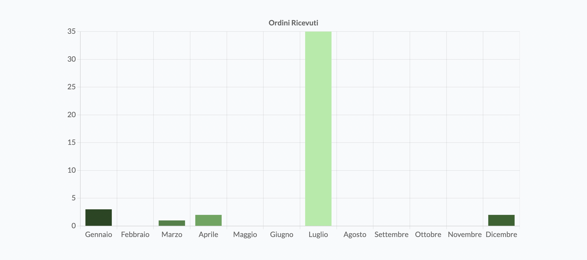

# DeliveBoo
DeliveBoo is a Web App that lets you order food in the city of Rome. 
This Web App includes different functionalities that will be explained step by step in this presentation file.

### Types of Users
There are two different types of users that can visit DeliveBoo.  

<b style="color: #aaeca4">The Customer</b> -> a non-registered user that wants to order from a restaurant.  

<b style="color: #f56f6f">The Admin/Restaurateur</b> -> a registered user that can add his restaurant on DeliveBoo and get orders from the customers.

### DeliveBoo HomePage
From the HomePage, <b style="color: #aaeca4">customers</b> can view all the affiliated restaurants in DeliveBoo,  
while <b style="color: #f56f6f">restaurateurs</b> can register their restaurants by clicking on the register button in the top-right corner.

### Filtering Restaurants
You can also filter all the restaurants on DeliveBoo by a selected type as you can see below.

### Searching Restaurant by name
If you already know the restaurant name, you can search it by its name using the top searchbar.

### Restaurant Menu
By clicking on the cards of the affiliated reastaurants you can access the public restaurant menu,  
here's an example on how the restaurant menu page looks like.

### Add To Cart
From the restaurant menu you can add plates to your Shopping Cart.  
You can also modify the plate quantity & empty your cart, on the other hand if you're satisfied with your order you can proceed to the checkout by clicking on the yellow button.

### Payment Checkout
This is the page where the customer will be redirected to pay his order.  
This Checkout page uses Braintree Payment Provider to save & process the transaction.  
If the transaction has success the customer will be redirected to the Order Summary.

## Admin Functionalities
As a Restaurant Owner (Admin) you have different functionalities that you can use.  
This is the Admin Dashboard where the all the restaurant informations are displayed.  
From the Dashboard you can also view your restaurant menu (to edit your plates), add a plate, and edit your restaurant info.

### View Menu

### Add Plate

### Edit Restaurant

### Order Statistics
Every restaurant has a statistics chart in its Dashboard representing the number of orders received in the current year divided by month.   
The chart has been realized using ChartJs library.

